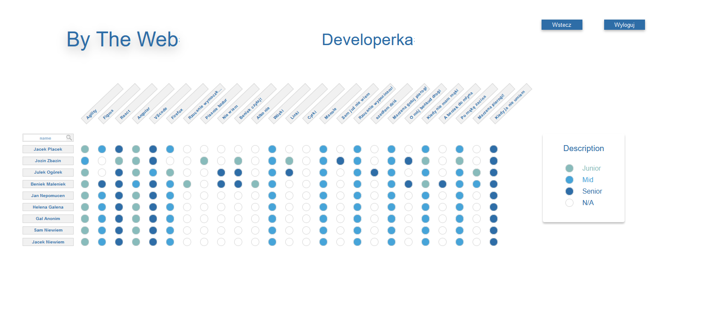

<h1 align="center">Skillex</h1>

An application for managing employee skills.

An application for managing employee skills.

The purpose of the application is to enable a quick analysis of employees' skills
in order to make full use of their potential by assigning them to the appropriate departments,
and thus optimize the company's operations.

React.js was used to create the application.

styled-components used to style HTML elements.

<h2 align="center">Screenshoots</h2>

